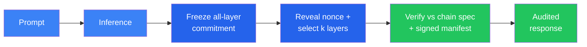

# What is Verathos?

**Verathos is an AI compute network on [Bittensor](https://bittensor.com) (Subnet 96).** Its proof-v2 candidate uses probabilistic sumcheck and polynomial-commitment audits for unpredictable selected registered model operations. Validators verify those selected claims on CPU without loading model weights. The proof-v2 execution profile remains subject to checkpoint E2E, adversarial substitute-execution, and performance release gates.

## What We Verify

### Verified Inference: Proof-v2 Candidate

A proof plugin integrates directly into vLLM serving. It captures the registered runtime inputs and outputs needed for proof v2 without delaying text-token streaming. After the miner freezes its all-layer commitment, the validator reveals a committed nonce and both sides derive the exact sampled layer and block set. Native batched sumcheck and IPA proofs are then generated for the selected claims.



### Intelligent Routing: Next

The current gateway routes by throughput and model utility scores. The next step is content-aware routing: a learned classifier that selects the best model for each query based on complexity, domain, and task type. This works with the existing model pool and improves inference quality without requiring new hardware or models from miners. See [Active Research](research.md) for details.

### Verified Training: In Testing

The same proof system extends to training. The training prover verifies the forward pass, backward pass (gradient GEMM), and optimizer step. Supported methods include full fine-tuning and LoRA, with AdamW, SGD, and Muon optimizers. A training job produces proofs that the correct base model was fine-tuned with the claimed data and optimizer, not fabricated or substituted. Final adapter weights are hashed and delivered on-chain for reproducibility. The protocol is implemented and tested but not yet active on the network.

## What the Proof Guarantees

| Claim | How it's verified |
|-------|-------------------|
| **Authenticated selected weights** | IPA openings bind selected operations to an authority-signed manifest that must match the live on-chain ModelSpec. |
| **Sound selected computation** | Batched sumcheck plus authenticated terminal openings verifies selected `X × W = Y` claims. |
| **Response binding** | The prompt and output-token history are transcript-bound. A nonce-selected hard audit opens one full residual corridor for a selected decode row and binds it through final hidden state, LM head, sampler, and returned token. |
| **Probabilistic coverage** | Light audits sample signed-weight equations. Hard audits sample operation and transition replay in selected layers under a signed policy. |

The current proof is not a full transformer SNARK. Light proofs do not open the
causal trace. Hard proofs independently replay selected full-attention/GDN
decode transitions and open a full-row residual corridor, but not every
attention head, projection column, or earlier prefill position. They do not yet
prove that the committed corridor or post-prefill cache was produced by the
registered model, so this candidate does not yet make a general economic
model-substitution guarantee. The raw K/V full-attention path is bounded and is
not a qualified 250k- or 1m-context proof path.

### TEE Verification (complementary, not yet enabled on mainnet)

Verathos also supports hardware-based verification via Trusted Execution Environments (Intel TDX, AMD SEV-SNP, NVIDIA Confidential Computing). TEE attestation proves a miner is running approved code inside a hardware-isolated enclave and can enable end-to-end encrypted prompts. See the [User Guide](user_guide.md#tee-inference-trusted-execution-environments) for details.

## Architecture

Verathos has three roles on the Bittensor network:

| Role | What it does |
|------|--------------|
| **Miner** | Serves models with probabilistic cryptographic audits. Can register multiple model endpoints per hotkey on Bittensor EVM (no UID pressure, scores accumulate). |
| **Validator** | Tests miners with canary requests and verifies proofs. Scores inference on model utility (parameters, context length, quantization), throughput, and time-to-first-token. Outside maintenance suppression, proof failure follows the configured failure/probation path. Sets weights on Bittensor. |
| **Gateway** | User-facing API gateway (OpenAI-compatible). Routes requests to miners weighted by score. Handles payments. |

On-chain smart contracts on Bittensor EVM handle model registration, miner endpoints, payment deposits, and validator discovery. See [Bittensor Integration](bittensor_integration.md) for architecture details and [Economic Model](economic_model.md) for contract mechanics.

## OpenAI-Compatible API

Drop-in replacement for any OpenAI SDK. Point your `base_url` at Verathos and
proof-bound responses carry validator verification status.

```python
from openai import OpenAI

client = OpenAI(
    base_url="https://api.verathos.ai/v1",
    api_key="vrt_sk_YOUR_KEY",
)

response = client.chat.completions.create(
    model="auto",  # or a specific model like "qwen3-8b"
    messages=[{"role": "user", "content": "Hello!"}],
)
print(response.choices[0].message.content)
```

Verified responses include `proof_verified: true` and verification timing. A
bounded v1 compatibility response is recorded as legacy compatibility, not v2
success; maintenance-suppressed proof failures remain unverified. Set `model`
to `"auto"` and the gateway picks the best available node across all models via
score-weighted routing.

## Integrations

Works with any OpenAI-compatible client out of the box. For popular AI agent frameworks, dedicated plugins add model discovery, proof metadata, and x402 payment support:

| Framework | Plugin | What it adds |
|-----------|--------|-------------|
| **LiteLLM** | `litellm-verathos` | `verathos/` model prefix, also unlocks CrewAI, Letta, Swarms |
| **LangChain** | `langchain-verathos` | `ChatVerathos` with proof metadata in `response_metadata` |
| **elizaOS** | `@elizaos/plugin-verathos` | Full model provider with x402 + CDP wallet for autonomous agents |
| **OpenClaw** | `openclaw-verathos` | Provider plugin with model discovery |
| **Hermes Agent** | Config only | Just set `base_url` in config |
| **AutoGen** | Config only | `OpenAIChatCompletionClient(base_url=...)` |

See [Integrations](integrations.md) for setup instructions and code examples.

## Pricing & Payment

### Pricing (USD per 1M tokens)

| Tier | Input | Output | Example models |
|------|-------|--------|----------------|
| Small | $0.08 | $0.14 | Qwen3-8B, Qwen3.5-9B, Llama-3.1-8B |
| Medium | $0.20 | $0.35 | Qwen3-14B, Gemma-3-27B, GPT-oss-20B, Qwen3.5-35B-A3B |
| Large | $0.35 | $0.65 | Llama-3.3-70B, Qwen3.5-122B-A10B |
| XL | $0.50 | $1.20 | Qwen3-235B-A22B, DeepSeek-V3, GPT-oss-120B, MiniMax-M2.5, Kimi-K2 |

Proof-bound responses carry their verification status, and verification cost is
included in the price. During a configured maintenance window, a response may
be explicitly unverified; maintenance does not turn it into a valid proof.

### Payment methods

| Method | How it works |
|--------|-------------|
| **TAO deposit** | Deposit TAO to PaymentGateway. 100% buys subnet alpha (permanent buy pressure, higher emissions). Owner cut starts at 0%, configurable up to 20%. |
| **USDC deposit** | Deposit USDC on Base L2. Credited as USD balance. |
| **x402 (pay-per-request)** | HTTP 402 protocol: attach USDC payment to each request. No account needed. Built for autonomous agents. |

## Quick Links

- **[User Guide](user_guide.md)**: API keys, deposits, inference requests, withdrawals
- **[Setup Guide](setup.md)**: Run a miner or validator
- **[API Reference](api.md)**: Full HTTP API reference
- **[Bittensor Integration](bittensor_integration.md)**: Epoch testing, scoring, architecture
- **[Inference Protocol](inference_protocol.md)**: Deep dive into sumcheck-based verification
- **[Active Research](research.md)**: Intelligent routing, verified training, and long-term vision
- **[Economic Model](economic_model.md)**: Tokenomics, alpha staking, pricing details
