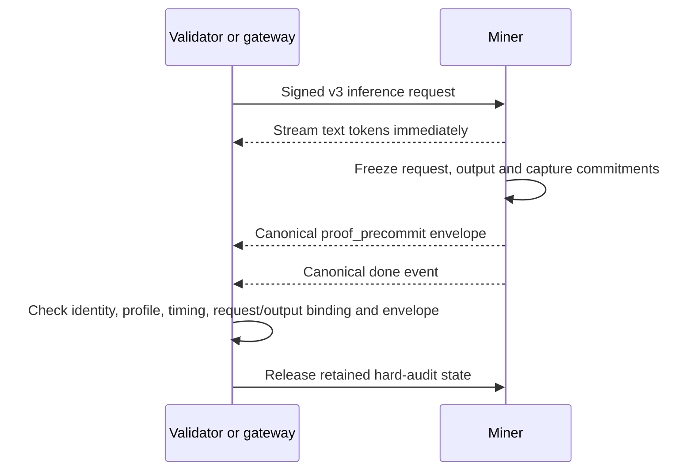
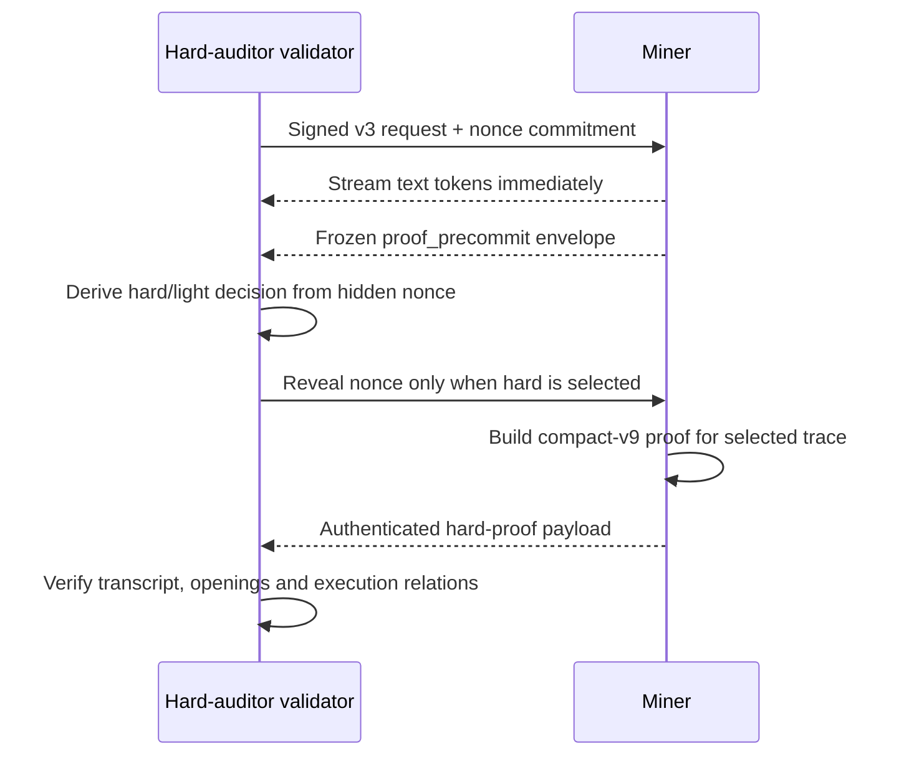

# Gleipnir proof protocol v3

Gleipnir is Verathos's probabilistic inference-audit protocol. It lets
validators check registered-model execution without loading the model weights
or repeating inference.

The protocol deliberately has two tiers:

- **Light:** every ordinary v3 response carries a nonce-free light proof that
  binds the request, sampler configuration, returned token sequence and the
  miner's captured execution roots in a canonical commitment envelope.
- **Hard:** an unpredictable canary is selected only after that commitment is
  frozen. The miner must then open and prove nonce-selected parts of the
  registered execution trace.

A light success is not described as a hard execution proof. Security comes
from ordinary requests being indistinguishable from requests that may receive a
post-commitment hard challenge, repeated probabilistic coverage, immediate
failure consequences, and the complementary hot-capacity audit.

## Trust anchors

Validators use three authenticated inputs:

1. the live on-chain `ModelSpec`, including model identity, quantization and
   registered model roots;
2. an authority-signed, versioned execution profile for that exact model and
   quantization;
3. content-addressed calibration and commitment artifacts authenticated by the
   signed profile.

The profile fixes the execution adapter, tensor encodings, registered
operations, dimensions, sampling policy, tolerances and proof-system version.
Unsupported or mismatched profiles fail closed. Validators download these
small authenticated artifacts, not the model weights.

Artifacts are network-scoped because their index binds the chain ID, netuid
and registry address. Testnet and mainnet indexes are therefore separate even
when they refer to the same model checkpoint.

## Light response flow

Ordinary API traffic uses the light tier and does not reveal a validator nonce.

The accepted envelope binds, among other profile-defined fields:

- validator and miner identities;
- the exact prompt-token digest and context length;
- model, quantization, signed profile and static-manifest digests;
- sampler parameters and output token IDs;
- emitted text and finish reason;
- runtime capture roots prepared by the qualified adapter;
- the validator's pre-request nonce commitment when the request is eligible for
  a hard audit.

Malformed, duplicate, late, stale or cross-request events are rejected. The
validator also checks that the final event matches the token stream it actually
observed.

The light proof authenticates request/output binding and the frozen audit
envelope. User interfaces should label it **Light proof accepted**; hard
canaries add nonce-selected execution checks.

## Hard canary flow

The designated hard auditor sends canary requests that use the same serving
path and request shape as ordinary traffic. The miner receives only the
validator's nonce commitment initially; it does not learn whether a hard proof
will be required until after its response envelope is frozen.

No text token is withheld to improve proof timing. Expensive proof work begins
after the nonce reveal and may overlap later serving subject to the miner's
bounded proof resources.

The nonce and frozen envelope derive the exact proof coordinates. The miner
does not choose the selected layers, operations, decode corridor or terminal
checks.

## What a hard proof checks

The signed profile defines the exact checks for a qualified architecture. The
current vLLM profiles combine:

- authenticated static weight commitments for registered projections;
- compact proofs of selected `X × W = Y` relations;
- captured residual anchors and connected layer transitions;
- nonce-selected decode-time corridors, including bounded GDN state windows;
- selected-head full-attention checks where the architecture uses full
  attention;
- final hidden-state, normalization, LM-head, sampler and returned-token
  binding;
- exact-set, dimension, encoding, ordering and transcript enforcement.

Static weights are authenticated against the registered model artifacts.
Dynamic witnesses are bound to the pre-nonce capture roots. Omissions,
duplicates, reordered sections, wrong dimensions, stale state and malformed
openings fail as proof failures rather than being downgraded to “not
requested.”

The audit is probabilistic: selected relations are sound, but every operation
is not opened on every request. The release claim is economic and repeated,
not deterministic verification of every transformer operation.

## Canary policy and validator roles

The signed canary policy currently defines two light canaries and one hard
canary per endpoint per epoch for the designated hard auditor. Scheduling and
prompt generation are secret-seeded and spread across the epoch.

- The **hard auditor** schedules the post-commitment hard challenge and
  publishes signed exact-epoch verdicts.
- An **independent verifier** may fetch retained hard bundles and replay the
  proof itself.
- Ordinary **follower validators** run their own light canaries and consume the
  authenticated owner verdict snapshot. Missing or invalid follower data is
  neutral; it is never fabricated into a pass or miner failure.

Only the subnet-configured hard-auditor hotkey can reveal a hard nonce. A miner
rejects unauthorized hard challenges before starting proof work.

## Hot-capacity audit

The hot-capacity audit is complementary. It checks that an endpoint retains
the advertised GPU workspace and compute capacity under a chain-timed
challenge. It does not replace the execution link in a hard inference proof,
and an inference proof does not replace capacity enforcement.

## Protocol transition and maintenance

Runtime policy contains a sorted allowlist of accepted inference protocols:

- `[1,3]` supports the bounded migration from legacy v1 to Gleipnir v3;
- `[3]` enforces v3 after the update window;
- inference protocol v2 is reserved and cannot be enabled.

Validators select the newest mutually supported allowed version per endpoint.
A legacy v1 result is never represented as a v3 result.

Maintenance grace is a separate operational control. It records genuine proof,
canary and capacity verdicts while suppressing only the configured scoring or
probation consequences. It never changes protocol admission and never makes an
invalid proof valid.

## Model and quantization support

The wire protocol is model- and quantization-independent, but support is not
automatic. Each architecture/model/quantization combination needs a qualified,
signed execution profile and calibration artifact. The current release covers
the profiles named by its authenticated release index. Unknown adapters,
unqualified quantizations and artifacts for another chain context fail closed.

Long-context serving can still use light v3 above a profile's hard-audit
ceiling. A miner may only advertise a servable range consistent with the signed
hard-audit reach defined by policy; qualification artifacts determine the
actual hard-auditable limits.

## Accurate interpretation

| Result | Meaning |
|---|---|
| Light proof accepted | Request, sampler, observed output and frozen capture envelope were consistently bound under v3 |
| Hard proof verified | The nonce-selected registered execution relations and terminal path passed the signed profile |
| Hard proof failed | The selected proof was missing, malformed, late or invalid |
| Follower verdict pass | The validator authenticated the designated auditor's exact-epoch signed decision |
| Maintenance-suppressed failure | The real failure was recorded, but configured operational consequences were temporarily suppressed |

Gleipnir should therefore be described as **probabilistic verified inference
with nonce-free light proofs and unpredictable hard execution audits**.
