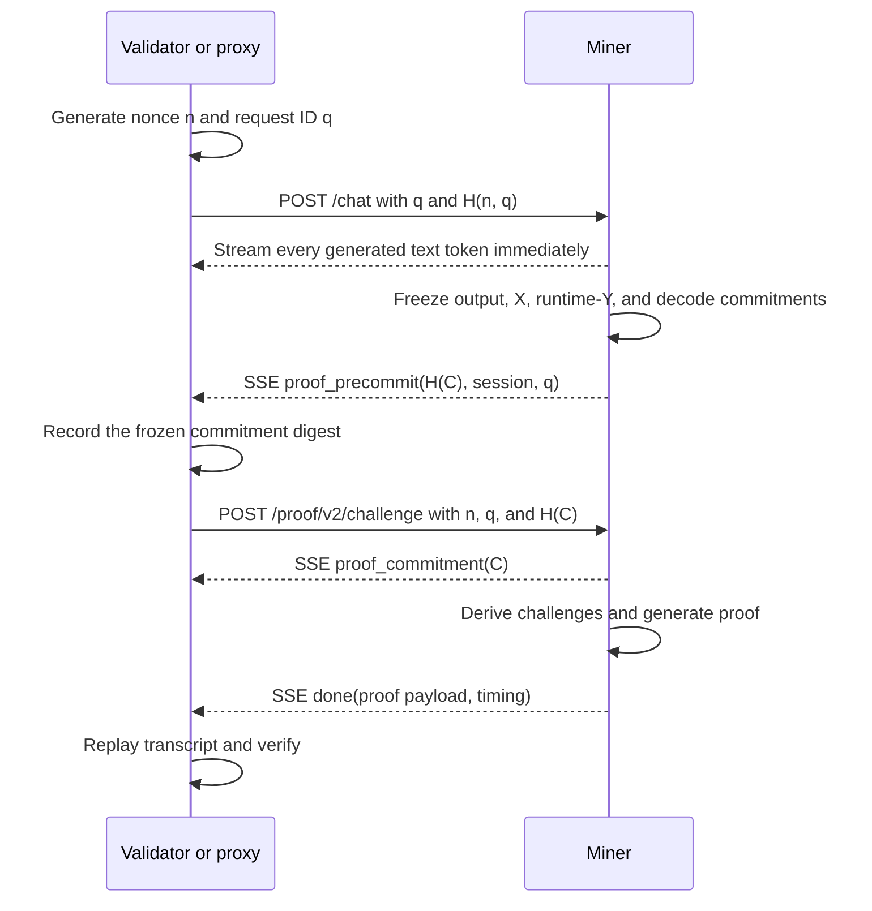

# Proof Protocol v2

Protocol version: 2.

Verathos proof v2 is a probabilistic, response-bound audit for dense vLLM
inference. It gives validators cryptographically sound checks for selected
registered matrix operations without requiring validators to download model
weights or run the model.

The protocol does not claim that every transformer operation is proven on every
request. It commits a complete captured decode-time projection shell and proves
an unpredictable subset of its authenticated runtime claims. Repeated requests,
canaries, probation, and hot-capacity audits are complementary controls; they do
not turn an unproven execution link into a cryptographic proof. The candidate is
not release-qualified for a general economic model-substitution claim until its
adversarial substitute-execution benchmark passes.

## Security scope

For every selected proof-v2 block, the verifier checks a statement of the form:

```text
captured runtime X × authenticated registered W = captured runtime Y
```

The selected statement is bound to:

- the validator request and prompt hash
- the exact on-chain `ModelSpec`
- an authority-signed proof-v2 weight manifest
- the complete pre-challenge X/runtime-Y commitment set
- output token IDs and decode metadata
- a validator nonce revealed only after the commitment is frozen
- exact operation identities, dimensions, blocks, and transcript rounds

A valid selected opening cannot use substituted weights, change X or Y after
challenge selection, omit a challenged operation, or choose its own dimensions
or block coordinates.

Before challenge selection, the miner commits a decode trace for every
supported row. A commitment alone does not establish that the trace or its
state was produced by the registered model. The light tier leaves the trace
sealed and proves only its selected registered equations. A successful light
proof therefore does not, by itself, establish that those equations produced
the returned token.

On a nonce-selected hard audit, the verifier opens one transcript-selected
generated decode row across every model layer and requires its residual
boundaries to form one ordered corridor. Separately, it proves all registered
linear families only in the stratified transcript-selected layers, at the
authority-signed number of blocks per operation. Nonlinear attention/GDN replay
is likewise limited to the selected transition layers. The verifier replays the
signed RMSNorm, residual, and SiLU bridges where the selected witnesses require
them, and binds the corridor row through final normalization, LM head, sampler,
and returned token.

The hard tier also verifies independently replayed, nonce-selected attention
transitions. Before the nonce, every decode-suffix row separately commits a
compact transition witness: GDN commits its replay inputs and state digests;
full attention commits a Merkle root over every logical query head's Q/K/V and
core output. For full attention, the proof opens the precommitted logical K/V
prefix for each selected K/V head plus the selected compact head witnesses,
applies the signed RoPE/GQA causal replay, and matches the selected
attention-core head output. The signed full-attention profile requires at least
two selected query heads per selected layer. For GDN, it opens the captured
prompt boundary and replays the generated decode suffix through the signed
state transition.

These checks make a prover-authored attention-state hash chain insufficient for
the selected witnesses. They do not establish that the opened corridor, its
post-prefill cache boundary, or unselected operations were produced by the
registered model. A sparse synthetic corridor or self-consistent fabricated
post-prefill state remains an adversarial-release test, not a solved
cryptographic claim. The raw full-attention K/V opening is a bounded reference
adapter, not a qualified 250k- or 1m-context proof path; requests outside its
qualified trace and payload limits must fail closed rather than silently fall
back to a hard success.

The current vLLM cache ABI starts at the final prompt-token row, so a one-token
response has no independently replayable decode suffix. If the post-commitment
hard draw selects such a response, it fails verification; it is never relabeled
as a successful light audit.

## Trust anchors

### On-chain ModelSpec

Validators load the registered model identity and metadata from chain,
including model ID, dimensions, quantization identity, canonical model roots,
tokenizer metadata, and other registration fields.

The existing on-chain Merkle roots are not recalculated per request and are not
used as the polynomial-commitment transcript.

### Signed proof-v2 manifest

Each supported model also has an authority-signed manifest containing the exact
proof-v2 polynomial commitments for:

- every fused MLP gate/up and down projection
- every full-attention QKV and output projection
- every GDN QKVZ, BA, and output projection
- the model-level `model.lm_head` operation
- the registered embedding and final-normalization boundary
- the exact per-layer RMSNorm parameters and attention profile
- the authority-signed hard-audit policy, including rate, stratification,
  selected-head requirements, and block coverage per operation

The manifest binds the commitments to the on-chain `ModelSpec`, operation
identities, dimensions, quantization/encoding parameters, tolerances, and
commitment-generator version. Validators reject a manifest whose signature or
model identity does not match the configured authority and live chain data.

Validators download only the signed manifest. Miners additionally download the
matching static weight catalog needed to construct openings. Artifacts are
content-addressed, hash-checked, cached locally, and may be served from the
configured HTTPS artifact store.

The catalog contains commitments, not a second copy of the model. After the
nonce selects a block, a miner reconstructs only that exact 16-column W witness
from its local checkpoint and checks the derived scale against the signed
manifest before proving it. This work is proportional to the selected proof
blocks, not to all model weights.

The protocol format is extensible, but the current execution-adapter candidate
is narrower: it targets the dense Qwen3.5/Qwen3.6 hybrid profile in the grouped
signed-INT4 `compressed-tensors` checkpoint layout, including its FP16
projections. It is not release-qualified until its real vLLM E2E and
performance gates pass. FP16/BF16-only, other GPTQ/AWQ layouts, FP8, NVFP4,
MoE, and other model families require their own qualified adapter and signed
manifest. Unsupported combinations fail closed.

## Network flow

Proof v2 uses one inference stream plus one small nonce-reveal request. The
reveal is necessary because the miner must freeze the commitment before learning
the sampling entropy.



The final text token is not buffered behind proof generation. The SSE
connection remains open for the proof event after normal token streaming.
Miner and validator measure a one-second last-text-token-to-proof-event
performance target. Missing that target is telemetry, not a proof-validity
failure; a valid proof remains valid regardless of response latency.

## Request and nonce commitment

The validator generates:

- a fresh 32-byte nonce `n`
- a fresh 32-byte proof challenge ID `q`
- `nonce_commitment = H(domain || n || q)`

The initial inference request contains `q` and `nonce_commitment`, but not `n`.
The miner cannot derive the final challenge set from the initial request.

After receiving `proof_precommit`, the validator sends `n` to the authenticated
challenge endpoint together with `q`, the session ID, and the commitment hash.
The miner verifies the nonce commitment and accepts exactly one idempotent reveal
for the frozen session. The miner streams the full commitment immediately after
the digest event, allowing its transfer to overlap the reveal and proof work.
It must hash to the pre-challenge digest before its proof can be accepted.

## Pre-challenge inference commitment

For the current dense runtime, the miner commits every generated decode row for
every registered layer operation before challenge selection:

- quantized `X` commitments for the exact projection set
- captured runtime `Y` block commitments for the same operations
- a per-token causal trace root containing all layer boundaries

The miner also commits:

- model and session identity
- input-token hash and prompt hash
- output-token hash and exact output count
- sampler configuration and sampling-verification rate
- greedy or sampled decode mode
- decode hidden-row root
- canonical top-k logits-row root when decode auditing can be selected
- signed manifest digest

The trace starts at the authenticated embedding of the final prompt token used
to produce the first returned token, then follows every returned decode step.
The complete prompt token sequence and prompt hash are committed. The runtime
also freezes the attention/GDN state at the final-prompt boundary before the
nonce. Hard verification replays selected generated-suffix transitions from
that boundary, but it does not independently recompute arbitrary earlier
prefill positions or prove the origin of the committed post-prefill cache.

The v2 verifier rejects legacy layer commitments and
`layer_transition_hashes`. Those fields did not prove a transformer transition
and are not part of the v2 security claim.

## Challenge derivation

After nonce reveal, both parties derive a transcript state from:

```text
validator nonce
signed manifest digest
canonical all-layer X/runtime-Y commitment envelope
model and request identity
prompt/input commitments
sampler policy
```

The exact registered operation universe comes from the signed manifest, not
from miner-provided layer counts or labels.

Current dense defaults target approximately 6.25% layer coverage:

| Model layers | Selected layers |
|---:|---:|
| 32 | 2 |
| 64 | 4 |
| 80 | 5 |

The light tier selects one registered operation in each selected layer and
leaves the causal trace sealed. The hard tier selects every registered
operation in each stratified selected layer, opens the full residual corridor
for one derived decode row, opens the exact selected causal transitions, and
adds the transcript-selected LM-head/decode audit. Each selected hard operation
opens the authority-signed number of blocks, bounded by its available block
count. The verifier requires the received proof descriptors and trace tier to
equal the derived challenge exactly: no omissions, additions, duplicates,
alternate dimensions, or miner-selected trace openings.

If a defect necessarily invalidates every registered operation in one layer and
the sampled witnesses are causally meaningful for that defect, the hard-tier
cumulative challenge probability is:

```text
P(caught after m requests) = 1 - (1 - k/N)^m
```

At `k/N = 6.25%`, the probability is about 48% after 10 hard audits, 90% after
36, and 99% after 72. This is a conditional layer-local calculation, not a
general model-substitution pass-rate bound. A defect confined to one operation
has a lower light-tier rate because the operation is also sampled within its
layer. Detection figures must therefore use the exact light/hard policy and
the affected operation set, then be checked against the substitute-execution
benchmark.

## Batched sumcheck and IPA openings

The arithmetic statement is reduced with a transcript-bound batched sumcheck.
Terminal evaluations are authenticated with polynomial-commitment openings;
they are not accepted as unauthenticated prover scalars.

Proof v2 uses the Pallas scalar field and Pedersen/IPA polynomial commitments,
providing an approximately 128-bit security target. The verifier checks:

1. the exact challenge descriptor and transcript
2. the committed X row opening
3. the signed-manifest W opening
4. the committed runtime-Y segment opening
5. the batched sumcheck identity
6. the terminal IPA evaluation openings
7. runtime-Y agreement within manifest-bounded quantization tolerance

The proof engine batches selected layer blocks and, when active, the hardened
LM-head audit into the same native proof path.

## Decode and LM-head audit

`sampling_verification_bps` is caller-visible request sampling for the ordinary
decode audit; it is committed into the transcript. It is not the hard-execution
policy. In particular, setting it to `10000` neither forces a hard audit nor
reveals whether the hard tier will be selected. The hard tier is selected only
from the post-commitment nonce and the authority-signed `hard_audit_bps`.

For ordinary decode sampling, `sampling_verification_bps` controls whether the
response receives the additional decode audit:

- `0`: no decode audit
- `1000`: approximately 10% of eligible requests
- `10000`: every eligible request

Public organic traffic currently requests `1000`. Canary traffic requests
`10000`.

When the ordinary Fiat-Shamir decode gate selects the audit, the challenge
chooses:

- one output position for responses up to 1024 tokens
- two positions up to 4096 tokens
- three positions above 4096 tokens

For every selected position, the miner opens the committed hidden row and
canonical top-k logits row. The verifier checks the exact output token history
and either:

- greedy decoding, including the committed presence-penalty policy; or
- canonical seeded sampling replay for supported sampled requests

One of the selected positions also carries the hardened LM-head PCS audit. The
validator derives four vocabulary blocks after the response commitment is
frozen. The set includes the returned token's block and the committed top
token's block, then samples additional top-k/outside blocks subject to the PCS
term budget. A selected hard audit independently requires its canonical
LM-head/sampler witness even when ordinary request sampling is zero.

The LM-head proof binds the selected hidden row to the authenticated
`model.lm_head` weights and to the committed runtime logits in those blocks. A
miner cannot replace the registered LM-head weights inside a valid challenged
opening.

This is still a sampled vocabulary audit, not a proof of every vocabulary logit
or every earlier transformer operation.

## Validator behavior

The validator:

1. resolves the exact live on-chain `ModelSpec`
2. resolves and authenticates the signed proof-v2 manifest
3. validates request, output, and precommit-digest bindings
4. replays nonce and Fiat-Shamir derivation
5. enforces the exact challenge set
6. verifies batched sumcheck and IPA openings
7. verifies decode/LM-head checks when selected
8. accepts only if every required check passes

Malformed, incomplete, late, or cryptographically invalid v2 payloads fail
closed.

For a locally verified organic request, proof failure is terminal. The proxy
does not emit a success receipt or settle API-credit/x402 usage. API-key credit
is not deducted, and an x402 reservation is released by the normal failure
cleanup. Text already streamed before verification cannot be recalled; the
stream ends with an error instead of a successful finish/usage event.

## Proof-version transition

Protocol compatibility and maintenance forgiveness are independent controls.
The owner publishes an ordered protocol allowlist in subnet runtime config.
Validators select the newest protocol supported by the validator, allowed by
the subnet, and advertised by the miner. For example, `[1,3]` accepts a valid
v1 proof from a legacy miner while selecting v3 for an updated miner. Changing
the allowlist to `[3]` makes v1 invalid immediately. A future rollout follows
the same `[3,4]` then `[4]` sequence without adding protocol-specific flags.

Inference proof protocol v2 is reserved and cannot be enabled through this
allowlist. Missing rollout configuration defaults to `[1,3]`, preventing a
binary update from enforcing v3 before the owner publishes that transition.
Invalid proofs remain invalid under every allowlist.

## Operational maintenance grace

Maintenance never changes the requested or accepted wire version. Its
suppression flags can temporarily make proof, canary, and hot-capacity failures
non-penalizing while miners update. A failed or missing proof remains recorded
as unverified; it is not relabeled as a valid proof. Proxy responses may
complete and settle unverified while the corresponding proxy suppression is
active.

Maintenance observations provide no proof coverage or pass-rate evidence.

When maintenance expires, enforcement resumes under whichever independent
proof-version policy is then active.

## Hot-capacity audit

Hot-capacity proof v2 is a separate validator-scheduled audit. It binds:

- validator-owned workload parameters
- validator-owned `gpu_index` (currently exactly `0`)
- `B_select`, `B_start`, and `B_proof` block hashes
- a pre-`B_proof` final commitment
- workspace state/transition roots
- sampled GEMM and FP64 work

Miners cannot choose `gpu_index` to alter the proof seed. Capacity proof
failures are recorded immediately but probation is applied only after all chain
anchors are finalized. A reorg marks the audit terminally reorged and cannot
produce probation. The database applies each finalized audit penalty at most
once.

## What proof v2 establishes

A successful light request establishes that every exact selected registered
equation verified against the authenticated manifest and the all-operation
pre-challenge commitment. It does not open the causal trace and therefore does
not alone establish that the selected equations produced the returned token.

A successful hard request additionally establishes one opened full-layer
residual corridor for a selected generated decode row, the selected X/Y rows
and transition replays, and the opened final hidden-row/LM-head/sampler/token
chain. The miner does not know whether it was selected until after freezing the
same complete commitment used by light requests.

It does not establish that every layer, attention head, projection column, or
arbitrary earlier prefill position executed correctly on that request. It also
does not prove that the committed corridor or post-prefill cache originated
from the registered-model prefill execution. Verathos therefore describes this
as a candidate probabilistic audit path, not a full per-request transformer
SNARK or a completed general economic model-substitution guarantee.
