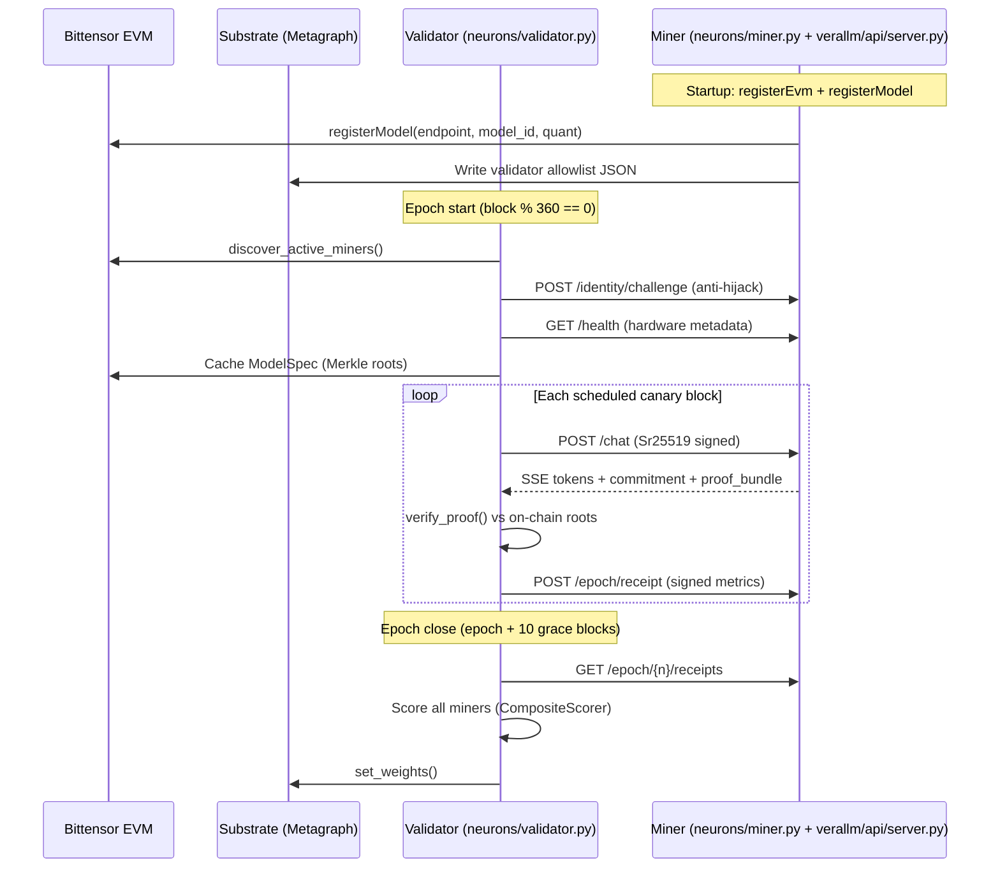
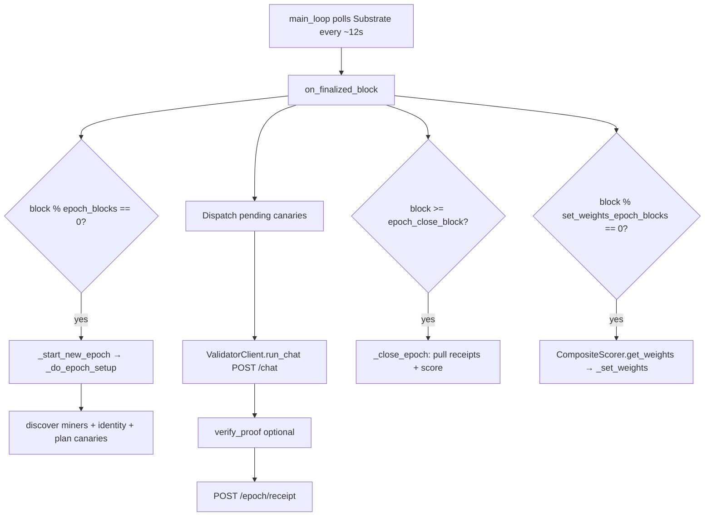
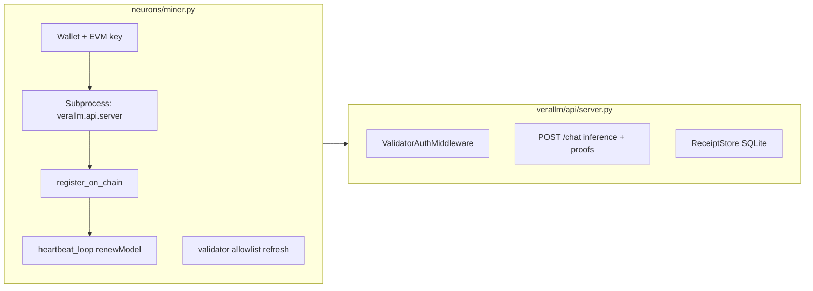
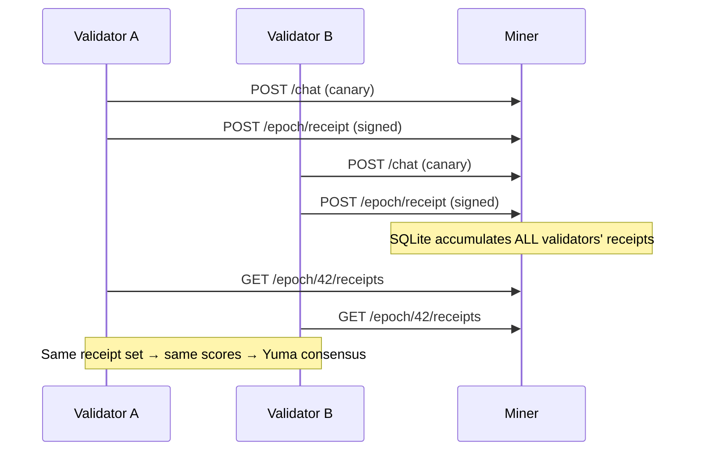

# Validator–Miner Workflow (Verathos Subnet 96)

This document explains how **validators** and **miners** coordinate on the Verathos subnet. It is written for operators and developers who want to understand the full lifecycle: discovery, canary testing, proof verification, receipt exchange, scoring, and weight setting.

> **Key design choice:** Verathos does **not** use Bittensor Synapse/axon/dendrite forwarding. Validators talk to miners over **HTTP REST** (`POST /chat`, receipt endpoints) with **Sr25519-signed requests**. Proof verification runs on the validator CPU in milliseconds.

---

## Table of Contents

1. [Big Picture](#1-big-picture)
2. [Architecture Diagrams](#2-architecture-diagrams)
3. [Configuration & Timing](#3-configuration--timing)
4. [Miner Workflow](#4-miner-workflow)
5. [Validator Workflow](#5-validator-workflow)
6. [Epoch Lifecycle (Block-by-Block)](#6-epoch-lifecycle-block-by-block)
7. [Canary Tests](#7-canary-tests)
8. [Inference + Proof Protocol](#8-inference--proof-protocol)
9. [Receipts & Yuma Consensus](#9-receipts--yuma-consensus)
10. [Scoring](#10-scoring)
11. [Weight Setting](#11-weight-setting)
12. [Security: Auth, Identity, Probation](#12-security-auth-identity-probation)
13. [File Map](#13-file-map)

---

## 1. Big Picture

| Role | Hardware | Main job |
|------|----------|----------|
| **Miner** | NVIDIA GPU (24 GB+ VRAM) | Serve models via vLLM, generate sumcheck proofs, register on Bittensor EVM, accumulate signed receipts |
| **Validator** | CPU only (no GPU) | Discover miners on-chain, run canary tests, verify proofs, push/pull receipts, score miners, call `set_weights()` on Substrate |

**Three coordination layers:**

1. **Bittensor Substrate** — UIDs, hotkeys, metagraph, `set_weights()`
2. **Bittensor EVM** — `ModelRegistry` (Merkle roots), `MinerRegistry` (endpoints, heartbeats)
3. **HTTP between validator ↔ miner** — inference, proofs, receipts

```
                                  Bittensor EVM
                             ┌─────────────────────┐
                             │  ModelRegistry      │  model specs + Merkle roots
                             │  MinerRegistry      │  endpoints, heartbeats
                             │  PaymentGateway     │  deposits, staking
                             └──────────┬──────────┘
                                        │
        ┌───────────────────────────────┼───────────────────────────────┐
        │                               │                               │
   ┌────▼─────┐                   ┌─────▼──────┐                 ┌──────▼─────┐
   │  Miner   │ ◄── canary ────   │ Validator  │                 │  Gateway   │
   │  (GPU)   │  ── receipt ──►   │  (CPU)     │──shared_state──►│  (API)     │
   │          │                   │            │                 │            │
   │ vLLM +   │ ◄── inference ─────────────────────────────────  │ OpenAI-    │
   │ proofs   │  ── response ─────────────────────────────────►  │ compatible │
   └──────────┘                   └────────────┘                 └────────────┘
```

---

## 2. Architecture Diagrams

### 2.1 Full sequence (one epoch)



### 2.2 Validator block loop



### 2.3 Miner two-process design



---

## 3. Configuration & Timing

Default epoch timing lives in `neurons/config.py`:

```27:38:neurons/config.py
    # Epoch timing (block-based)
    epoch_blocks: int = 360  # ~72 min at 12s/block
    epoch_grace_blocks: int = 10  # blocks after epoch boundary before pulling receipts
    set_weights_epoch_blocks: int = 360  # weight-setting interval (= epoch by default)

    # Canary testing
    canary_small_count: int = 12  # small canary tests per miner per epoch
    canary_full_context_count: int = 1  # full-context canary tests per miner per epoch
    canary_proof_sample_rate: float = 0.30  # probability of ZK proof verification on small canaries
    canary_inference_timeout: float = 300.0  # per-small-test inference timeout (seconds)
    canary_full_context_inference_timeout: float = 900.0
    epoch_receipt_pull_timeout: float = 30.0  # GET /epoch/{n}/receipts per-miner timeout (seconds)
```

| Parameter | Default | Meaning |
|-----------|---------|---------|
| `epoch_blocks` | 360 | ~72 minutes per epoch |
| `epoch_grace_blocks` | 10 | Wait after epoch end before pulling receipts |
| `canary_small_count` | 12 | Small synthetic tests per miner per epoch |
| `canary_full_context_count` | 1 | Full-context boundary test per miner |
| `canary_proof_sample_rate` | 0.30 | ~30% of small canaries get full proof verification |
| `heartbeat_interval_sec` | 43200 (12h) | Miner renews on-chain lease |

---

## 4. Miner Workflow

### 4.1 Entry point

Run with:

```bash
python -m neurons.miner \
    --wallet miner --hotkey default \
    --netuid 96 \
    --subtensor-network finney \
    --endpoint https://YOUR-PUBLIC-IP-OR-DOMAIN
```

`MinerNeuron` wraps the inference server and handles chain registration:

```193:205:neurons/miner.py
class MinerNeuron:
    """Wraps the existing VeraLLM miner server with Bittensor chain registration."""

    def __init__(self, config: NeuronConfig):
        self.config = config
        self._provider: Optional[Web3Provider] = None
        self._miner_client: Optional[MinerRegistryClient] = None
        self._server_process: Optional[subprocess.Popen] = None
        self._running = True

        self.evm_pk = ""
        self.evm_addr = ""
        self.uid: Optional[int] = None  # resolved from metagraph during setup()
```

### 4.2 Setup: wallet → EVM address → UID

```207:246:neurons/miner.py
    def setup(self, private_key: Optional[str] = None):
        """Initialize chain connection and derive EVM credentials.

        Args:
            private_key: Raw EVM private key (hex). If provided, skips
                bittensor wallet derivation (useful for Anvil testing).
                If None, derives from the bittensor wallet.
        """
        if private_key:
            # Direct private key mode (Anvil / testing)
            from eth_account import Account
            pk = private_key if private_key.startswith("0x") else f"0x{private_key}"
            self.evm_pk = pk
            self.evm_addr = Account.from_key(pk).address
            bt.logging.info(f"EVM address (from --private-key): {self.evm_addr}")
        else:
            WalletCls = getattr(bt, "Wallet", None) or bt.wallet
            wallet = WalletCls(name=self.config.wallet_name, hotkey=self.config.hotkey_name)
            hotkey_seed = _extract_hotkey_seed(
                self.config.wallet_name, self.config.hotkey_name, wallet,
            )
            self.hotkey_seed = hotkey_seed

            self.evm_pk = derive_evm_private_key(hotkey_seed)
            self.evm_addr = derive_evm_address(hotkey_seed)
            bt.logging.info(f"EVM address (from wallet): {self.evm_addr}")

        self._provider = Web3Provider(self.config)
        self._miner_client = MinerRegistryClient(self.config, provider=self._provider)

        if not private_key:
            # Resolve UID from Substrate metagraph — needed for registerEvm().
            self.uid = self._resolve_uid_with_retry()
            bt.logging.info(f"Resolved UID: {self.uid}")
```

**Why EVM?** Bittensor EVM contracts (`MinerRegistry`, `ModelRegistry`) store endpoints and Merkle roots. The miner's EVM key is deterministically derived from the Bittensor hotkey seed so on-chain identity links to the subnet UID.

### 4.3 On-chain registration

```696:737:neurons/miner.py
    def register_on_chain(
        self,
        model_id: str,
        endpoint: str,
        quant: str,
        max_context_len: int,
        max_retries: int = 5,
    ) -> int:
        """Register this miner's model on MinerRegistry.

        Returns the on-chain model index for use in heartbeat renewals.
        """
        from web3 import Web3

        for attempt in range(1, max_retries + 1):
            try:
                # Step 1: Check for existing registration (must succeed)
                existing_index = self.check_existing_registration(
                    model_id, endpoint, quant, max_context_len,
                )
                if existing_index is not None:
                    return existing_index

                # Step 2: Ensure EVM→UID mapping
                self._ensure_evm_registered()

                # Step 3: Register
                spec_ref = Web3.solidity_keccak(["string"], [model_id])
                bt.logging.info(f"Registering on-chain: model={model_id} endpoint={endpoint} quant={quant} ctx={max_context_len}")
                tx = self._miner_client.register_model(
                    model_id=model_id,
                    endpoint=endpoint,
                    model_spec_ref=spec_ref,
                    quant=quant,
                    max_context_len=max_context_len,
                    private_key=self.evm_pk,
                )
                bt.logging.info(f"Registered: {tx}")
```

Registration flow:

1. `registerEvm(uid)` — link EVM address to Bittensor UID
2. `registerModel(...)` — publish endpoint, model, quant, max context
3. `renewModel(index)` every 12h — keep 24h lease alive

### 4.4 Validator allowlist (miner protects itself)

The miner subprocess only accepts signed requests from registered validators. The parent neuron refreshes a JSON file from the metagraph:

```773:779:neurons/miner.py
    def _refresh_validator_allowlist(self) -> None:
        """Query the metagraph for validators and write their SS58 hotkeys to disk.

        The JSON file is read by ValidatorAuthMiddleware in the server subprocess.
        Validators must have a permit AND meet the on-chain minValidatorStake
        threshold (read from ValidatorRegistry every refresh cycle).
        """
```

### 4.5 Heartbeat loop

```934:970:neurons/miner.py
    def heartbeat_loop(self, model_index: int = 0):
        """Periodically renew the model lease.

        On startup, checks remaining lease time via a read-only RPC call
        (no gas).  Only renews immediately if the lease won't survive
        until the next scheduled heartbeat.
        """
        interval = self.config.heartbeat_interval_sec
        ...
        while self._running:
            ...
            try:
                tx = self._miner_client.renew_model(model_index, private_key=self.evm_pk)
                bt.logging.info(f"Renewed model at index {model_index}: {tx}")
```

If the lease expires, the miner re-registers automatically.

### 4.6 Inference server (subprocess)

The miner starts `python -m verallm.api.server` which:

- Loads vLLM + proof plugin
- Enforces `ValidatorAuthMiddleware` on `/chat`, `/inference`, receipt endpoints
- Streams SSE: `token` events → final `done` with commitment + proof bundle
- Stores receipts from all validators in SQLite

Receipt endpoints:

```1196:1241:verallm/api/server.py
@app.post("/epoch/receipt")
async def receive_epoch_receipt(body: EpochReceiptBody):
    """Accept a validator-signed service receipt for the current epoch.

    After verified inference, the validator pushes a signed receipt to the
    miner.  The miner accumulates receipts from ALL validators throughout
    the epoch.  At epoch boundary, validators pull the complete batch via
    GET /epoch/{n}/receipts — every validator sees the same set.

    Receipts are persisted to SQLite so they survive server restarts.
    """
    epoch = body.epoch_number
    ...
    count = state.receipt_store.add(epoch, receipt_dict)
    ...
    return {"status": "accepted", "epoch": epoch, "count": count}


@app.get("/epoch/{epoch_number}/receipts")
async def get_epoch_receipts(epoch_number: int):
    """Return all accumulated receipts for the given epoch.

    Validators pull this at epoch boundary.  Every validator receives the
    SAME receipt set, computes the SAME scores, and produces IDENTICAL
    weights (Yuma consensus).
    """
    receipts = state.receipt_store.get(epoch_number)
    return {
        "epoch": epoch_number,
        "receipt_count": len(receipts),
        "receipts": receipts,
    }
```

---

## 5. Validator Workflow

### 5.1 Entry point & class overview

Run with:

```bash
python -m neurons.validator \
    --wallet validator --hotkey default \
    --netuid 96 \
    --subtensor-network finney
```

The module docstring defines the full lifecycle:

```1:28:neurons/validator.py
#!/usr/bin/env python3
"""ValidatorNeuron — epoch-based canary testing for Verathos.

Lifecycle:
1. Ensure hotkey is linked (for reportOffline access).
2. Subscribe to finalized block headers via WebSocket.
3. On epoch boundary (every ``epoch_blocks``):
   a. Discover ALL active miners from MinerRegistry.
   b. Plan canary tests: ``canary_small_count`` small + ``canary_full_context_count``
      full-context tests per miner, spread across the epoch.
4. Each block: dispatch pending canary tests (target_block <= current_block).
   a. Send test through POST /chat (same endpoint as organic proxy traffic).
   b. Optionally verify ZK proof.
   c. Create signed receipt with metrics (TTFT, tok/s, tokens generated).
   d. Push receipt to miner via POST /epoch/receipt.
5. After epoch + grace window:
   a. Pull all receipts from each miner: GET /epoch/{n}/receipts.
   b. Build EpochOutcome per miner-model entry.
   c. Score entries: utility × throughput² × latency, update EMAs.
   d. Apply traffic volume multiplier.
6. At weight-setting boundary:
   a. Compute per-UID weights (additive aggregation × traffic volume).
   b. ``set_weights()`` on Substrate.
```

`ValidatorNeuron.__init__` wires the major components:

```312:357:neurons/validator.py
    def __init__(self, config: NeuronConfig):
        self.config = config
        self.scorer = CompositeScorer(
            ema_alpha=config.ema_alpha,
            throughput_power=config.throughput_power,
        )
        self._running = True
        self._probation_tracker = ProbationTracker(
            required_passes=config.probation_required_passes,
            escalation_epochs=config.probation_escalation_epochs,
        )

        # SQLite-backed validator state database
        db_path = os.path.join(
            os.environ.get("VERALLM_DATA_DIR", os.path.expanduser("~/.verathos")),
            "verathos_validator.db",
        )
        self._db = ValidatorStateDB(db_path=db_path)
        ...
        # Epoch state
        self._current_epoch: int = 0
        self._epoch_start_block: int = 0
        self._canary_scheduler: Optional[CanaryScheduler] = None
        self._epoch_miners: List[ActiveMiner] = []
```

### 5.2 Main loop: block polling

The validator aligns to epoch boundaries and polls Substrate every ~12 seconds:

```3572:3605:neurons/validator.py
    def main_loop(self):
        """Run the validator via WebSocket subscription to finalized block headers.

        Uses substrate WebSocket subscription for real-time block tracking.
        Falls back to polling if subscription is unavailable.
        """
        bt.logging.info(
            f"Starting validator (epoch={self.config.epoch_blocks} blocks, "
            f"grace={self.config.epoch_grace_blocks} blocks, "
            f"canary_small={self.config.canary_small_count}, "
            f"canary_full={self.config.canary_full_context_count})",
        )
        ...
        current = self._get_current_block_with_retry()
        epoch_blocks = self.config.epoch_blocks
        blocks_into_epoch = current % epoch_blocks
        current_epoch_start = current - blocks_into_epoch
        ...
        self._run_with_polling()
```

### 5.3 `on_finalized_block` — the orchestrator

Every new block triggers four possible actions:

```643:715:neurons/validator.py
    def on_finalized_block(self, block_number: int, block_hash: bytes):
        """Called by WebSocket subscription on each finalized block.

        Drives the epoch lifecycle: start epoch, dispatch canary tests,
        close epoch (pull receipts + score), set weights.
        """
        ...
        # 1. Epoch boundary → start new epoch
        if block_number % epoch_blocks == 0:
            if self._pending_epoch_close is not None:
                self._try_close_epoch(self._pending_epoch_close)
            self._start_new_epoch(block_number)

        # 2. Dispatch pending canary tests
        if self._canary_scheduler is not None:
            pending = self._canary_scheduler.get_pending_tests(block_number)
            if pending:
                ...
                self._dispatch_canary_tests(pending)

        # 3. Epoch close: grace blocks after epoch boundary
        if (self._pending_epoch_close is not None
                and block_number >= self._epoch_close_block):
            self._try_close_epoch(self._pending_epoch_close)

        # 4. Weight-setting boundary
        if block_number % self.config.set_weights_epoch_blocks == 0:
            ...
            self._control_executor.submit(_set_weights_with_retry)
```

### 5.4 Epoch setup: discover miners

At epoch start, `_do_epoch_setup` discovers active miners from `MinerRegistry`:

```890:903:neurons/validator.py
    def _do_epoch_setup(self, epoch_start_block: int, epoch_number: int):
        """Heavy epoch setup — runs on a background executor thread."""
        ...
        try:
            self._epoch_miners = discover_active_miners(
                self._miner_client, self._model_client,
            )
        except Exception as e:
            bt.logging.warning(f"Discovery RPC failed: {e} — will fall back to previous miners")
            self._epoch_miners = []
        bt.logging.info(f"Epoch {epoch_number} (block {epoch_start_block}): discovered {len(self._epoch_miners)} miner entries")
```

Discovery logic (`neurons/discovery.py`):

```42:88:neurons/discovery.py
def discover_active_miners(
    miner_client,
    model_client=None,
) -> List[ActiveMiner]:
    """Discover all active miners from the MinerRegistry.

    Flow:
    1. Get model list from ModelRegistry (optional — if provided, only
       discovers miners for registered models)
    2. For each model: getProvidersForModel() -> addresses
    3. For each address: getMinerModels() -> entries
    4. Filter: active=True and expiresAt > now
    5. Deduplicate by (address, model_index)
    """
    now = int(time.time())
    seen = set()  # (address, model_index)
    active = []
    ...
    bt.logging.info(f"Discovered {len(active)} active miner-model entries")
    return active
```

Each `ActiveMiner` carries endpoint, model, quant, context length, and optional TEE/GPU metadata:

```15:39:neurons/discovery.py
@dataclass
class ActiveMiner:
    """A miner discovered from the on-chain registry."""

    address: str
    model_id: str
    endpoint: str
    quant: str
    max_context_len: int
    model_index: int  # index in miner's model array
    hotkey_ss58: str = ""
    coldkey_ss58: str = ""
    ...
    gpu_uuids: List[str] = field(default_factory=list)
```

### 5.5 Identity challenge (anti-hijacking)

Before trusting an endpoint, the validator verifies the miner controls the registered EVM address:

```2949:2960:neurons/validator.py
    def _verify_miner_identity(self, miner: ActiveMiner) -> Optional[bool]:
        """Verify a miner controls the endpoint it registered.

        Sends a random nonce to POST /identity/challenge.  The miner signs
        (nonce || evm_address) with its EVM key.  We recover the signer and
        compare against the on-chain registered address.

        Returns:
            True  — identity confirmed (signer matches registered address).
            False — identity FAILED (signer mismatch — likely hijacking).
            None  — endpoint doesn't support challenge (404/501/timeout).
        """
```

### 5.6 Execute canary: inference + proof + receipt

Each canary uses `ValidatorClient.run_chat()` — the same `/chat` endpoint as organic gateway traffic:

```1417:1454:neurons/validator.py
            with ValidatorClient(
                miner_url=test.miner_endpoint,
                config=verification_config,
                timeout=(...),
                verify_tls=False,
                chain_config=self.config if not self.config.mock else None,
                model_id=test.model_id,
                validator_hotkey_ss58=self._validator_hotkey_ss58,
                validator_seed=self._validator_private_key,
            ) as client:
                ...
                messages = [{"role": "user", "content": test.prompt}]
                full_text, commitment, proof_bundle, nonce, timing = client.run_chat(
                    messages=messages,
                    max_new_tokens=test.max_new_tokens,
                    do_sample=do_sample,
                    temperature=temperature,
                    sampling_verification_bps=sampling_bps,
                    enable_thinking=enable_thinking,
                    presence_penalty=test.presence_penalty,
                    top_k=test.top_k,
                    top_p=test.top_p,
                )
```

If `test.verify_proof` is true, the validator verifies locally against epoch-cached on-chain Merkle roots:

```1467:1543:neurons/validator.py
                if test.verify_proof:
                    try:
                        cached_spec = self._model_spec_cache.get(test.model_id)
                        ...
                        result, verify_timing = client.verify_proof(
                            proof_bundle, nonce,
                            expected_sampling_verification_bps=sampling_bps,
                            expected_do_sample=do_sample,
                            expected_temperature=temperature,
                            ...
                        )
                        proof_verified = result.passed
                        if not proof_verified:
                            ...
                            self._on_proof_failure(
                                test.miner_address, test.model_index,
                                endpoint=test.miner_endpoint,
                            )
```

On proof failure, the miner is immediately put on **probation** and removed from organic routing via `shared_state.json`.

### 5.7 Push signed receipt to miner

After each canary (or organic verification), the validator signs and pushes a `ServiceReceipt`:

```2764:2835:neurons/validator.py
    def _push_receipt_to_miner(
        self,
        miner_address: str,
        miner_endpoint: str,
        ...
    ) -> bool:
        """Push signed receipt. Returns True on 200; retries transient transport/5xx."""
        receipt = create_receipt(
            miner_address=miner_address,
            model_id=model_id,
            ...
            validator_hotkey=self._validator_hotkey_bytes,
            validator_private_key=self._validator_private_key,
            proof_verified=proof_verified,
            proof_requested=proof_requested,
            is_canary=is_canary,
        )

        url = f"{miner_endpoint.rstrip('/')}/epoch/receipt"
        ...
        auth_headers = _sign(
            method="POST", path="/epoch/receipt", body=receipt_body,
            hotkey_ss58=self._validator_hotkey_ss58,
            hotkey_seed=self._validator_private_key,
        )
        ...
        resp = httpx.post(url, content=receipt_body, headers={...})
```

Receipt schema (`neurons/receipts.py`):

```40:66:neurons/receipts.py
@dataclass
class ServiceReceipt:
    """A validator-signed receipt proving verified inference occurred."""

    miner_address: str
    model_id: str
    model_index: int
    epoch_number: int
    commitment_hash: bytes
    timestamp: int

    # Performance metrics (measured by validator, signed -> unforgeable)
    ttft_ms: float
    tokens_generated: int
    generation_time_ms: float
    tokens_per_sec: float

    prompt_tokens: int = 0
    proof_verified: bool = False
    proof_requested: bool = False
    tee_attestation_verified: object = None
    is_canary: bool = False

    validator_hotkey: bytes = b""
    validator_signature: bytes = b""
```

### 5.8 Epoch close: pull receipts and score

```1937:2026:neurons/validator.py
    def _close_epoch(self, epoch_number: int):
        """Close an epoch: pull receipts from all miners, score, update EMAs.

        Two-pass approach:
        1. Pull all receipts from all miners.
        2. Compute per-model demand from organic traffic.
        3. Score each miner-model entry with demand bonus applied.
        4. Post demand scores on-chain.
        """
        ...
        # Build validator authority snapshot for receipt verification
        receipt_authority = ValidatorAuthority(
            ss58_to_uid=ss58_to_uid,
            validator_permit=permits,
            stakes=stakes,
            min_stake=self._cached_min_validator_stake,
        )

        # Pass 1: collect all receipts
        miner_receipts, all_epoch_receipts = self._collect_epoch_receipts(
            epoch_number, receipt_authority,
        )
```

Receipt pull uses signed GET requests:

```2694:2758:neurons/validator.py
    def _pull_epoch_receipts(
        self,
        miner: ActiveMiner,
        epoch_number: int,
        authority: ValidatorAuthority | None = None,
    ) -> List[ServiceReceipt]:
        """Pull all receipts from a miner for the given epoch.

        GET /epoch/{epoch_number}/receipts — returns all accumulated receipts.
        Each receipt is verified against ``authority``.
        """
        url = f"{miner.endpoint.rstrip('/')}/epoch/{epoch_number}/receipts"
        ...
        auth_headers = sign_request(
            method="GET", path=path, body=b"",
            hotkey_ss58=self._validator_hotkey_ss58,
            hotkey_seed=self._validator_private_key,
        )
        resp = httpx.get(url, timeout=..., headers=auth_headers, verify=False)
        ...
        for r_dict in receipt_dicts:
            receipt = receipt_from_dict(r_dict)
            if not verify_service_receipt(receipt, epoch_number, authority=authority):
                continue
            verified.append(receipt)
```

---

## 6. Epoch Lifecycle (Block-by-Block)

| Phase | When | What happens |
|-------|------|--------------|
| **Epoch start** | `block % 360 == 0` | Discover miners, identity check, plan 13 canaries/miner, cache ModelSpec |
| **During epoch** | Each block | Dispatch canaries whose `target_block <= current_block`; push receipts |
| **Epoch close** | `epoch_start + 360 + 10` grace | Pull all receipts, score, update EMA, write shared state |
| **Weight set** | `block % 360 == 0` | Normalize scores, apply burn/blacklist, `set_weights()` |

Timeline for one epoch (~72 min + ~2 min grace):

```
Block 0        Block 180       Block 360       Block 370
  |──────────────|──────────────|──grace──|
  epoch start    mid-epoch      epoch end   close + score
  discover       canaries       last        pull receipts
  plan canaries  running        canaries    set_weights (if boundary)
```

---

## 7. Canary Tests

`CanaryScheduler` spreads tests across the epoch using hashed target blocks:

```103:120:neurons/canary.py
@dataclass
class CanaryScheduler:
    """Plans and dispatches canary tests across an epoch.

    Tests are spread across the epoch with target blocks derived from a
    hash of (epoch_number, validator_hotkey, miner_address, test_index)
    plus a random per-epoch salt.
    """

    epoch_number: int
    epoch_start_block: int
    epoch_blocks: int
    validator_hotkey: str = ""
    validator_seed: bytes = b""
    small_count: int = 12
    full_context_count: int = 1
    proof_sample_rate: float = 0.30
```

| Test type | Count | Purpose |
|-----------|-------|---------|
| **Small** | 12/epoch | 500–2000 input tokens; ~30% get full proof verification |
| **Full-context** | 1/epoch | ~80% of `max_context_len`; always verifies proof |

Canaries are designed to be **indistinguishable from organic traffic** — miners cannot tell if a request is a test.

---

## 8. Inference + Proof Protocol

### 8.1 Validator sends request

`ValidatorClient.run_chat()` posts to `/chat` with a random `validator_nonce`:

```557:595:verallm/api/client.py
        nonce = os.urandom(32)

        request_body = {
            "messages": messages,
            "validator_nonce": nonce.hex(),
            "max_new_tokens": max_new_tokens,
            "do_sample": do_sample,
            "temperature": temperature,
            "sampling_verification_bps": max(0, min(10_000, int(sampling_verification_bps))),
            "enable_thinking": enable_thinking,
        }
        ...
        with self.client.stream("POST", f"{self.miner_url}/chat",
                                json=request_body) as resp:
            resp.raise_for_status()
            for event_type, data in _parse_sse_stream(resp):
                if event_type == "token":
                    ...
                elif event_type == "done":
                    commit_data = data.get("commitment", {})
                    proof_data = data.get("proof_bundle", ...)
```

### 8.2 Validator verifies proof (CPU only)

```1091:1146:verallm/api/client.py
    def verify_proof(
        self,
        proof_bundle: InferenceProofBundle,
        nonce: bytes,
        ...
    ) -> Tuple[VerificationResult, Dict[str, float]]:
        """Verify the proof bundle locally (lightweight -- no model needed).

        Re-derives beacon and challenges from the commitment + nonce
        (Fiat-Shamir), then verifies sumcheck proofs against on-chain
        weight Merkle roots.
        """
        ...
        # Re-derive beacon from commitment + nonce (Fiat-Shamir)
        commitment = proof_bundle.commitment
        beacon = derive_beacon_from_nonce(
            commitment_hash=commitment.commitment_hash(),
            validator_nonce=nonce,
        )

        if proof_bundle.beacon != beacon:
            return VerificationResult.failure(
                f"Beacon mismatch: miner used {proof_bundle.beacon[:8].hex()}..., "
                f"expected {beacon[:8].hex()}..."
            ), timing_details
```

**Trust anchor:** weight Merkle roots come from on-chain `ModelRegistry`, cached per epoch in `validator._model_spec_cache`. Wrong weights or wrong computation → proof fails → score zero.

---

## 9. Receipts & Yuma Consensus



**Why receipts?** Throughput and latency metrics are measured by the validator and signed with Sr25519. Miners cannot forge good metrics. At epoch close, every validator pulls the **full** receipt set and runs the **same** scoring function → identical weights.

---

## 10. Scoring

### 10.1 Formula

From `neurons/scoring.py`:

```
SCORE = UTILITY × (tokens/1M)^throughput_power × TTFT_FACTOR × SPEED_FACTOR × demand_bonus × tee_bonus
```

Default `throughput_power = 2.0` (quadratic — sybil defense: splitting one GPU across N UIDs hurts total score).

### 10.2 Hard penalties

```273:285:neurons/scoring.py
    if outcome.proof_tests > 0 and outcome.proof_failures > 0:
        bt.logging.info(f"Proof verification failure for {_who} ... -> score=0")
        return 0.0

    if outcome.tee_tests > 0 and outcome.tee_failures > 0:
        bt.logging.info(f"TEE attestation failure for {_who} ... -> score=0")
        return 0.0
```

### 10.3 EMA smoothing

`CompositeScorer.update()` applies exponential moving average across epochs:

```649:697:neurons/scoring.py
    def update(
        self,
        uid: int,
        address: str,
        model_index: int,
        outcome: EpochOutcome,
        ...
    ) -> Optional[float]:
        ...
        epoch_score = compute_epoch_entry_score(
            outcome,
            active_params_b=active_params_b,
            ...
        )
        self._update_entry_ema(entry, epoch_score)
        return epoch_score
```

### 10.4 Weights from EMA

```715:735:neurons/scoring.py
    def get_weights(self) -> Dict[int, float]:
        """Get normalized weights for all UIDs.

        WEIGHT(uid) = normalize( AGGREGATE )
        """
        raw = {}
        for uid, state in self.states.items():
            score = state.aggregate_score
            if score < 1e-6:
                score = 0.0
            raw[uid] = score

        total = sum(raw.values())
        if total <= 0:
            return {uid: 0.0 for uid in raw}
        return {uid: s / total for uid, s in raw.items()}
```

---

## 11. Weight Setting

At each weight boundary, the validator normalizes scores, applies emission burn, and calls Substrate:

```3455:3486:neurons/validator.py
    def _set_weights(self, weights: Dict[int, float]):
        """Set weights on Bittensor substrate."""
        if not weights:
            return

        uids = list(weights.keys())
        vals = [weights[uid] for uid in uids]

        max_val = max(vals) if vals else 1.0
        if max_val <= 0:
            return

        import torch
        uid_tensor = torch.tensor(uids, dtype=torch.long)
        weight_tensor = torch.tensor(
            [int(v / max_val * 65535) for v in vals],
            dtype=torch.long,
        )

        try:
            self._subtensor.set_weights(
                wallet=self._wallet,
                netuid=self.config.netuid,
                uids=uid_tensor,
                weights=weight_tensor,
                version_key=spec_version,
            )
```

**Emission burn:** a configurable fraction (default 50% from on-chain `SubnetConfig`) is redirected to the subnet owner UID instead of miners.

---

## 12. Security: Auth, Identity, Probation

### 12.1 Sr25519 request signing

All validator→miner requests (except public endpoints) require signed headers:

```11:18:neurons/request_signing.py
Signing scheme:
    message = f"{method}:{path}:{sha256(body).hex()}:{timestamp}"
    signature = Sr25519.sign(message, hotkey_keypair)

Headers:
    X-Validator-Hotkey:    SS58-encoded hotkey address (string)
    X-Validator-Signature: 64-byte Sr25519 signature (hex)
    X-Validator-Timestamp: Unix seconds (string)
```

### 12.2 Miner-side auth middleware

```81:89:verallm/api/validator_auth.py
class ValidatorAuthMiddleware(BaseHTTPMiddleware):
    """Require a valid validator signature on all non-public endpoints.

    Reads the allowed validator SS58 hotkeys from a JSON file on disk.
    The file is re-read every FILE_RELOAD_INTERVAL seconds.

    When no validators file exists, blocks all non-public requests (deny by
    default).
    """
```

Public endpoints (no auth): `/health`, `/model_spec`, `/identity/challenge`, `/tee/info`.

### 12.3 Proof failure → probation

Any proof failure (canary or organic) triggers:

1. **Instant score zero** for that epoch
2. **Probation** — 100% proof verification on all subsequent requests
3. **Proxy cutoff** — miner removed from organic routing via `shared_state.json`
4. **Rehabilitation** — 3 consecutive clean epochs to exit probation

---

## 13. File Map

| File | Role |
|------|------|
| `neurons/validator.py` | Validator neuron: block loop, canaries, scoring, weights |
| `neurons/miner.py` | Miner neuron: registration, heartbeat, server subprocess |
| `neurons/config.py` | Epoch/canary/scoring defaults |
| `neurons/discovery.py` | On-chain miner discovery |
| `neurons/canary.py` | Canary scheduling and prompts |
| `neurons/scoring.py` | `CompositeScorer`, epoch score formula |
| `neurons/receipts.py` | `ServiceReceipt` format and verification |
| `neurons/request_signing.py` | Sr25519 HTTP auth |
| `neurons/validator_db.py` | SQLite state (EMA, analytics) |
| `neurons/shared_state.py` | JSON for gateway/proxy routing |
| `verallm/api/server.py` | Miner HTTP server (inference, receipts) |
| `verallm/api/client.py` | `ValidatorClient` — chat + `verify_proof` |
| `verallm/api/validator_auth.py` | Miner-side validator auth |
| `verallm/chain/miner_registry.py` | EVM MinerRegistry client |
| `contracts/src/MinerRegistry.sol` | On-chain registration contract |
| `docs/bittensor_integration.md` | Official epoch/scoring reference |
| `docs/inference_protocol.md` | Proof generation and verification deep dive |

---

## Quick Reference: One Request End-to-End

```
1. Validator signs POST /chat
2. Miner ValidatorAuthMiddleware verifies Sr25519 + allowlist
3. Miner runs vLLM inference, captures activations, builds commitment + sumcheck proofs
4. Miner streams SSE: token...token → done{commitment, proof_bundle}
5. Validator optionally calls verify_proof() vs on-chain Merkle roots
6. Validator signs ServiceReceipt with TTFT, tok/s, proof result
7. Validator signs POST /epoch/receipt → miner stores in SQLite
8. At epoch close: validator GET /epoch/{n}/receipts from all miners
9. CompositeScorer updates EMA → set_weights() on Substrate
```

---

## See Also

- [Bittensor Integration](bittensor_integration.md) — epoch lifecycle and scoring parameters
- [Inference Protocol](inference_protocol.md) — sumcheck verification details
- [Setup Guide](setup.md) — running miners and validators in production
- [API Reference](api.md) — HTTP endpoint documentation
